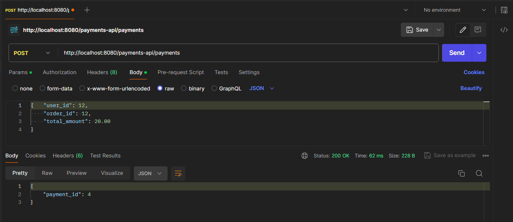
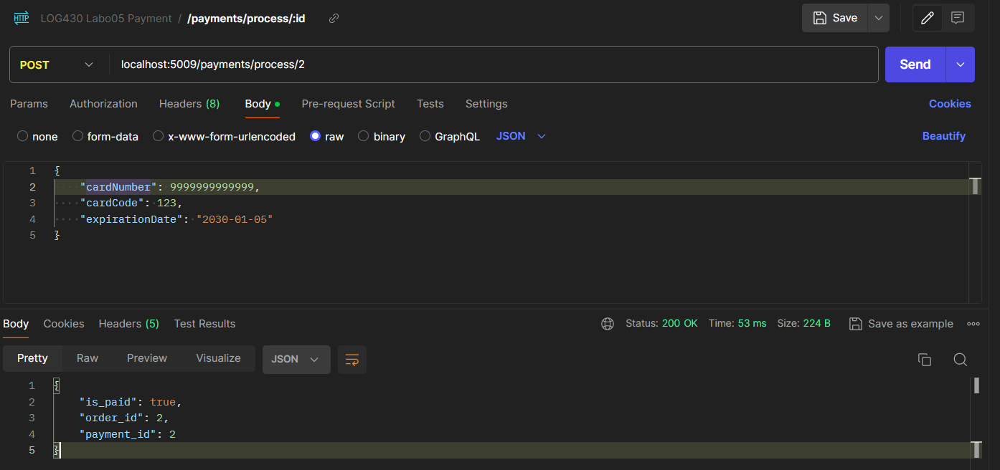
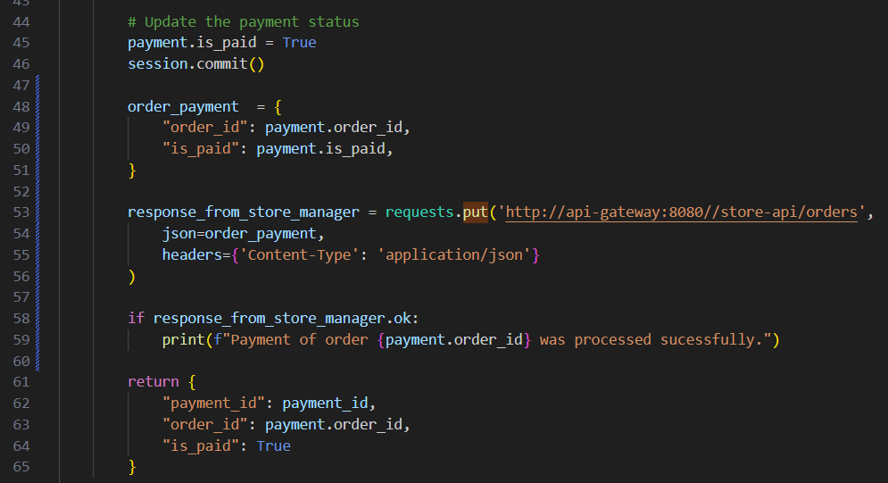
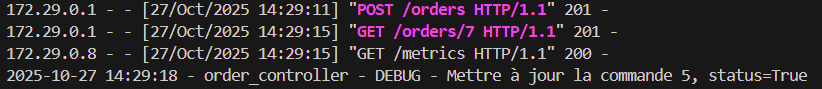
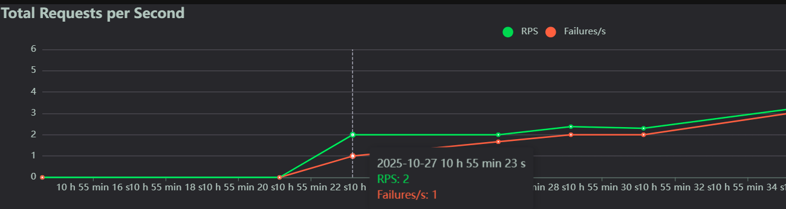
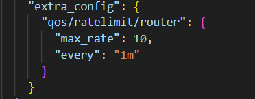

 \
William Lavoie \
Rapport de laboratoire \
LOG430 — Architecture logicielle \
28 Octobre 2025
École de technologie supérieure

## Questions
### Question 1
#### Quelle réponse obtenons-nous à la requête à POST /payments ? Illustrez votre réponse avec des captures d'écran/terminal.

En envoyant la requête à `POST http://localhost:8080/payments-api/payments` par Postman, ce qui correspond à la route utilisé par `store-manager`, à l'exception que `localhost` est remplacé par le nom du conteneur dans le réseau Docker, on obtient la réponse suivante. Le service de paiement retourne l'id du paiement qui a été exécuté, avec un code 200 pour signifier que l'opération s'est bien passé.

### Question 2
#### Quel type d'information envoyons-nous dans la requête à POST payments/process/:id ? Est-ce que ce serait le même format si on communiquait avec un service SOA, par exemple ? Illustrez votre réponse avec des exemples et captures d'écran/terminal.

### Question 3
#### Quel résultat obtenons-nous de la requête à POST payments/process/:id?

### Question 4
#### Quelle méthode avez-vous dû modifier dans log430-a25-labo05-payment et qu'avez-vous modifié ? Justifiez avec un extrait de code.

J'ai modifié la méthode `update_status_to_paid` car c'est elle qui s'occupe de faire passer l'état des paiements à `is_valid = True`, donc il est logique que ce soit cette méthode qui appelle `store_manager` afin de transmettre cette information. J'ai ajouté la partie suivante à la méthode:

Dans les logs de `store_manager`, on voit les lignes suivantes qui démontre que les commandes sont mises à jour correctement.

### Question 5
#### À partir de combien d'utilisateurs votre application cesse-t-elle de répondre correctement (avec Redis + Optimisation + Nginx load balancing) ? Quelle est la latence moyenne (50ème percentile) et le taux d'erreur observés ? Illustrez votre réponse à l'aide des graphiques Locust.
L'application a cessé de fonctionner avec un pourcentage d'erreur de 13% à partir de 245 utilisateurs. 

Le nombre d'utilisateurs maximum n'a essentiellement pas changé avec l'introduction de Nginx, ce qui était attendu car le *bottleneck* est MySQL, or les 3 instances de `store_manager` utilisent toute la même base de données, ainsi le nombre de requêtes envoyé à MySQL n'a pas changé.
Par contre, la latence a augmenté car le traffic est partagé par les instances de `store_manager`. La latence moyenne est maintenant de 5ms.

### Question 6
#### Avez-vous constaté une amélioration des performances à mesure que nous avons mis en œuvre différentes approches d'optimisation ? Quelle a été la meilleure approche ? Justifiez votre réponse en vous référant aux réponses précédentes.

|                | Nombre Utilisateurs | Taux Erreur (%) | Latence (ms) |
|----------------|--------------------|-------------|---------|
| **MySQL**     |           100         |     0        |     26    |
| **MySQL + optimisation**      |       175             |       10      |   N/A     |   
| **Redis + optimisation**      |       240             |     10        |     9    |
|**Redis + Optimisation + Nginx load balancing**              |     245              |     13          |   5    |

Selon la table ci-dessus, formée à partir des données trouvées pour les questions 1-5, on voit que les performances ont amélioré avec chacun des changements. La latence moyenne a diminiué d'environ 500% et le nombre d'utilisateurs maximum a augmenté de 140% (175 à 245, en sachant que nous ne savons pas le nombre maximum pour le premier cas, je ne l'ai donc pas pris en compte.)

On voit également que la meilleure approche a été la dernière, tel qu'attendu. Le plus grand problème quant à la performance suite à ces changements est lié à la base de données MySQL. Pour améliorer davantage les performances, on pourrait utiliser plusieurs techniques tel que le *connection pooling*, améliorer l'indexage sur la BD ou bien encore faire des requêtes asynchrones à l'aide d'un outil comme `Celery`.

### Question 7
#### Dans le fichier nginx.conf, il existe un attribut qui configure l'équilibrage de charge. Quelle politique d'équilibrage de charge utilisons-nous actuellement ? Consultez la documentation officielle Nginx si vous avez des questions.

L'attribut en question est `least_conn` qui indique que les requêtes sont acheminés vers le serveur avec la plus petite charge. On peut lire sous la documentation Nginx l'explication suivante: 
`least-connected — next request is assigned to the server with the least number of active connections` (https://nginx.org/en/docs/http/load_balancing.html). 

## Observations additionnelles

Le script d'intégration/déploiement continu (CI/CD) est presque identique à celui du laboratoire 3, je n'ai donc pas vraiment rencontré de problème avec ça. J'ai utilisé un `self-hosted runner` sur la VM et le script roule sur Github Actions.

J'ai seulement ajouté la ligne `docker network rm labo04-network || true` afin de détruire le réseau Docker à chaque déploiement sur la VM pour toujours commencer avec une installation fraîche. La seconde partie évite de lancer une erreur si le réseau n'existe pas déjà.

Autrement, j'ai rencontré un problème dans la section 9 en utilisant les méthodes suggérées, soit `hset` de Redis, car celle-ci s'attend à reçevoir une clé et une valeur et non une liste, j'ai donc utilisé `set` à la place. J'ai remplacé `hget` par `get` afin que cela concorde. 